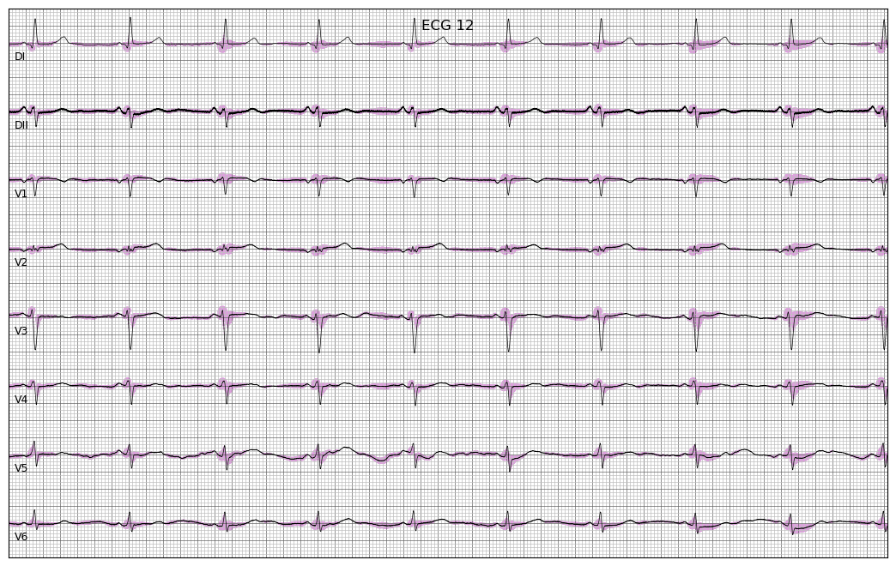

# ECG Heatmaps


Generate heatmap visualizations in ECG pytorch models. The base functions are available in ``generate_heatmaps.py`` and
one example is available in ``example.py``.

# Example

Download example ECGs: (in wfdb format)
```sh
> wget https://www.dropbox.com/s/rbxe71a2l9ukoeg/example_exams.zip?dl=0 -O example_exams.zip
> unzip example_exams.zip
> cat example_exams/RECORDS.txt 
TNMG437332_N1
TNMG247003_N1
TNMG247001_N1
TNMG247005_N1
TNMG2905463_N1
TNMG2834_N1
TNMG286512_N1
TNMG2678117_N1
```

Download model:
```sh
> wget https://www.dropbox.com/s/idq4uhu3ab012xg/model.pth?dl=0 -O model.pth
```

Download ecg-preprocessing and add it to your python path
```sh
> git clone https://github.com/antonior92/ecg-preprocessing.git
> export PYTHONPATH="${PYTHONPATH}:ecg-preprocessing"
```

Run example:
```sh
python example.py example_exams/TNMG247001_N1 model.pth --save img/example_output.png
```



